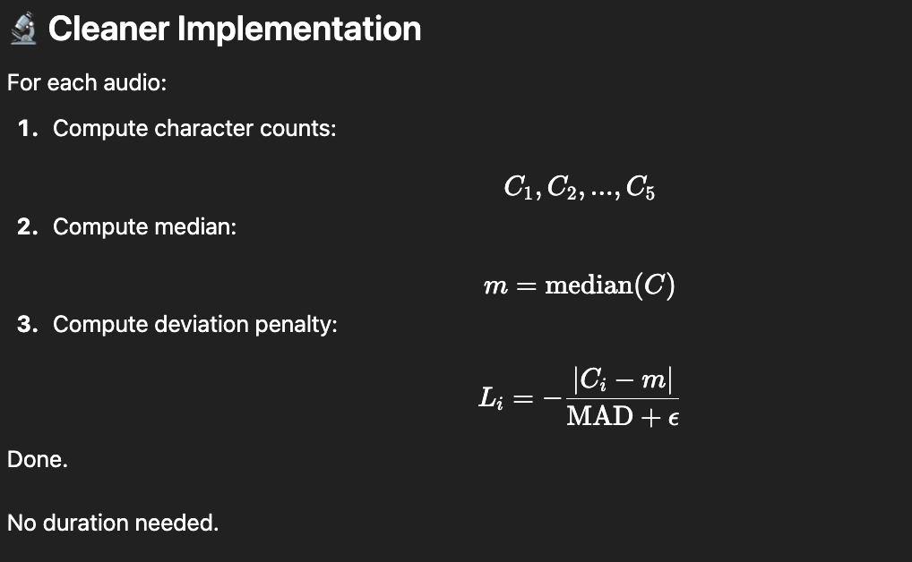

spacing, filler words, punctuations, number to word, contractions, 
word + character error rate

whisper
    remove spacing, remove punctuation, change num to wrod, change contraction.

grammar
   remove filler

weights (linguistic / acoustic / length)
    tukka (mostly)
    nn (unlikely)

//lenght consistency

//assumption : all transcripts are of the same language, anf the language is given, and the audio languae is the same as the transcript language

